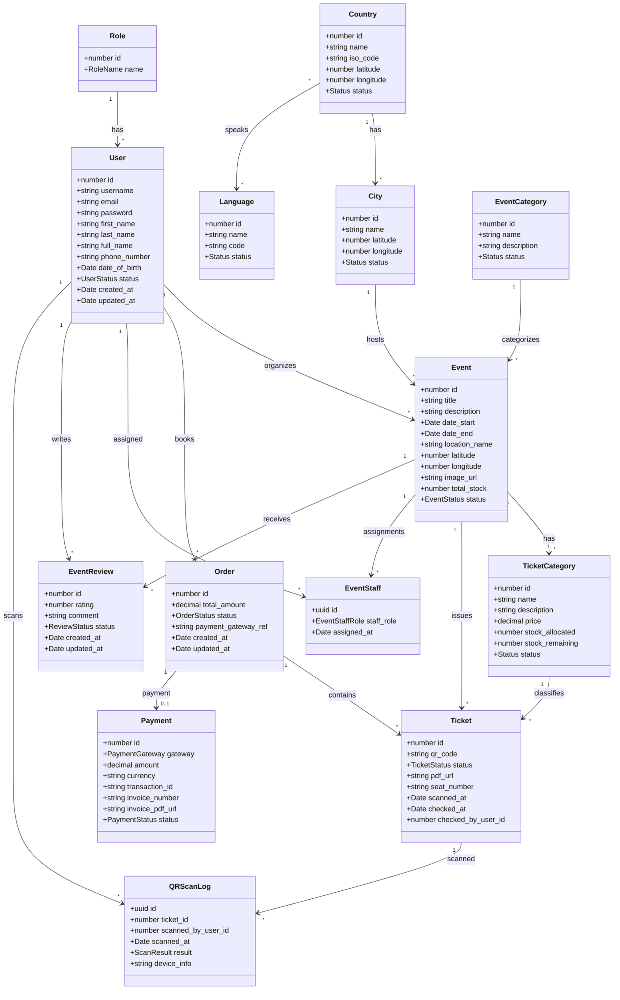

# Morocco360 Admin Backoffice Implementation Spec

This file describes the backend, frontend, and UML structure required for the
Morocco360 admin dashboard expansion.

Use this document as the source of truth when updating the codebase.

## Goal

Build a complete admin backoffice for Morocco360 with backend APIs and frontend
dashboard pages for managing:

- Users
- Organizers
- Staff
- Events
- Bookings and tickets
- Comments and reviews
- Payments and invoices
- Settings: languages, countries, cities, event categories

Every list page must support:

- Search
- Filters
- Sorting where useful
- Backend pagination
- Frontend pagination
- Clear loading, empty, and error states

## Important Existing Architecture Rules

- Keep one `User` entity for all people.
- Do not create separate `Admin`, `Organizer`, or `Staff` entities.
- Admin, organizer, staff, and normal user are roles assigned to `User`.
- Keep the existing `Role` entity with role names:
  - `ADMIN`
  - `ORGANIZER`
  - `STAFF`
  - `USER`
- Backend source of truth is NestJS + TypeORM entities and services.
- Frontend must keep the existing Next.js route-handler BFF pattern.
- Browser code must call same-origin Next.js `/api/**` routes, not NestJS
  directly.
- Keep all new dashboard screens visually synchronized with:
  - Public pages
  - Current admin dashboard design
  - User mobile app area
  - Existing light/dark theme tokens
  - Existing RTL/i18n behavior

## Corrected Domain Model

The desired diagram should be based on these classes.

Existing or expected core entities:

- `User`
- `Role`
- `Country`
- `City`
- `Language`
- `EventCategory`
- `Event`
- `TicketCategory`
- `Order`
- `Ticket`
- `Payment`
- `EventStaff`
- `EventReview`
- `QRScanLog`

Naming notes:

- Use `TicketCategory`, not `SetsCategory`.
- Use `EventCategory`, not `EventsCategories`.
- Use `Order` for booking/reservation records.
- Use `Ticket` for individual tickets inside a booking.
- Use `Payment` for transaction state and invoice data.
- Use `EventReview` for comments and reviews.

## Suggested Entity Structure

### User

Represents all account types.

Fields:

- `id`
- `username`
- `email`
- `password`
- `first_name`
- `last_name`
- `full_name`
- `phone_number`
- `date_of_birth`
- `status`: `ACTIVE`, `SUSPENDED`
- `refresh_token_hash`
- `created_at`
- `updated_at`

Relations:

- Many users belong to one role.
- One user can create many orders.
- One user can organize many events.
- One user can be assigned as staff to many events through `EventStaff`.
- One user can write many reviews.

Do not store `age` as a permanent column. Compute age from `date_of_birth`.

### Role

Fields:

- `id`
- `name`: `ADMIN`, `ORGANIZER`, `STAFF`, `USER`

Relations:

- One role has many users.

### Country

Fields:

- `id`
- `name`
- `iso_code`
- `latitude`
- `longitude`
- `status`: `ACTIVE`, `SUSPENDED`
- `created_at`
- `updated_at`

Relations:

- One country has many cities.
- One country can have many spoken languages.

### City

Fields:

- `id`
- `name`
- `latitude`
- `longitude`
- `status`: `ACTIVE`, `SUSPENDED`
- `created_at`
- `updated_at`

Relations:

- Many cities belong to one country.
- One city can have many events.

When an event receives a city, the country is automatically known through
`city.country`.

### Language

Fields:

- `id`
- `name`
- `code`
- `status`: `ACTIVE`, `SUSPENDED`
- `created_at`
- `updated_at`

Relations:

- One language can be spoken in many countries.
- One country can have many languages.

Use a many-to-many relation between countries and languages unless the product
explicitly requires only one language per country.

### EventCategory

Used for event taxonomy, for example music, sport, culture, cinema.

Fields:

- `id`
- `name`
- `description`
- `status`: `ACTIVE`, `SUSPENDED`
- `created_at`
- `updated_at`

Relations:

- One event category has many events.

### Event

Fields:

- `id`
- `title`
- `description`
- `date_start`
- `date_end`
- `location_name`
- `latitude`
- `longitude`
- `image_url`
- `total_stock`
- `status`: `ACTIVE`, `SUSPENDED`, `DRAFT`, `SOLD_OUT`, `CANCELLED`
- `created_at`
- `updated_at`

Relations:

- Many events belong to one organizer user.
- Many events belong to one city.
- Many events belong to one event category.
- One event has many ticket categories.
- One event has many staff assignments through `EventStaff`.
- One event has many tickets.
- One event has many reviews.

### TicketCategory

Represents ticket tiers for one event, for example standard, VIP, student.

Fields:

- `id`
- `name`
- `description`
- `price`
- `stock_allocated`
- `stock_remaining`
- `status`: `ACTIVE`, `SUSPENDED`
- `created_at`
- `updated_at`

Relations:

- Many ticket categories belong to one event.
- One ticket category has many tickets.

### Order

Represents a booking/reservation.

Fields:

- `id`
- `total_amount`
- `status`: `PENDING`, `PAID`, `CANCELLED`, `REFUNDED`, `SUSPENDED`
- `payment_gateway_ref`
- `created_at`
- `updated_at`

Relations:

- Many orders belong to one user.
- One order has many tickets.
- One order has zero or one payment.

### Ticket

Represents one generated ticket.

Fields:

- `id`
- `qr_code`
- `status`: `PENDING`, `VALID`, `CHECKED`, `CANCELLED`, `REFUNDED`,
  `SUSPENDED`
- `pdf_url`
- `seat_number`
- `scanned_at`
- `checked_at`
- `checked_by_user_id`
- `created_at`
- `updated_at`

Relations:

- Many tickets belong to one order.
- Many tickets belong to one event.
- Many tickets belong to one ticket category.
- Many tickets can be checked by one staff user.
- One ticket can have many scan logs.

### Payment

Fields:

- `id`
- `gateway`: `STRIPE`, `PAYPAL`, `BANK_CARD`
- `amount`
- `currency`
- `transaction_id`
- `invoice_number`
- `invoice_pdf_url`
- `status`: `PAID`, `PENDING`, `NOT_PAID`, `FAILED`, `REFUNDED`
- `created_at`
- `updated_at`

Relations:

- One payment belongs to one order.

Invoice display and printing can be generated from `Payment`, `Order`, `User`,
`Ticket`, and `Event` data. A separate `Invoice` entity is optional unless the
project needs immutable invoice snapshots.

### EventStaff

Links staff or organizers to events.

Fields:

- `id`
- `staff_role`: `ORGANIZER`, `STAFF`
- `assigned_at`

Relations:

- Many staff assignments belong to one event.
- Many staff assignments belong to one user.
- Assignment can optionally track `assigned_by`.

### EventReview

Used for comments and reviews.

Fields:

- `id`
- `rating`
- `comment`
- `status`: `PENDING`, `APPROVED`, `UNAPPROVED`
- `created_at`
- `updated_at`

Relations:

- Many reviews belong to one event.
- Many reviews belong to one user.
- Review can optionally track `approved_by`.

### QRScanLog

Fields:

- `id`
- `ticket_id`
- `scanned_by_user_id`
- `scanned_at`
- `result`: `SUCCESS`, `ALREADY_USED`, `INVALID`, `WRONG_EVENT`, `EXPIRED`
- `device_info`

Relations:

- Many scan logs belong to one ticket.
- Many scan logs belong to one scanning user.

## UML Class Diagram

Use this as the corrected UML class structure.



## Backend Requirements

### Shared API Behavior

All admin list endpoints must accept:

- `page`
- `limit`
- `search`
- `sortBy`
- `sortOrder`
- entity-specific filters such as `status`, `role`, `countryId`, `cityId`,
  `eventId`, `categoryId`, `paymentStatus`, `dateFrom`, `dateTo`

All paginated endpoints should return:

```json
{
  "data": [],
  "meta": {
    "page": 1,
    "limit": 20,
    "total": 0,
    "totalPages": 0,
    "hasNextPage": false,
    "hasPreviousPage": false
  }
}
```

Use reusable DTOs/helpers for pagination instead of duplicating this logic in
every service.

### Admin Users

Backend capabilities:

- List users with search/filter/pagination.
- Create user.
- Edit user.
- Suspend/activate user.
- View all bookings/orders reserved by one user.

Suggested endpoints:

- `GET /admin/users`
- `POST /admin/users`
- `GET /admin/users/:id`
- `PATCH /admin/users/:id`
- `PATCH /admin/users/:id/status`
- `GET /admin/users/:id/orders`

### Admin Organizers

Organizers are users with role `ORGANIZER`.

Backend capabilities:

- List organizers with search/filter/pagination.
- Create organizer.
- Edit organizer.
- Suspend/activate organizer.
- View all events created by or assigned to one organizer.

Suggested endpoints:

- `GET /admin/organizers`
- `POST /admin/organizers`
- `GET /admin/organizers/:id`
- `PATCH /admin/organizers/:id`
- `PATCH /admin/organizers/:id/status`
- `GET /admin/organizers/:id/events`

### Admin Staff

Staff are users with role `STAFF`.

Backend capabilities:

- List staff with search/filter/pagination.
- Create staff.
- Edit staff.
- Suspend/activate staff.
- View all events assigned to one staff user.

Suggested endpoints:

- `GET /admin/staff`
- `POST /admin/staff`
- `GET /admin/staff/:id`
- `PATCH /admin/staff/:id`
- `PATCH /admin/staff/:id/status`
- `GET /admin/staff/:id/events`

### Admin Events

Backend capabilities:

- List events with search/filter/pagination.
- Create event.
- Edit event.
- Suspend/activate event.
- Assign organizer to event.
- Search organizers for assignment.
- Assign staff to event.
- Search staff for assignment.
- Assign event category to event.
- Assign city to event.
- Derive country automatically from assigned city.
- Manage ticket categories for event.
- Print/export list of all users booking the event with organizer and staff
  info.

Suggested endpoints:

- `GET /admin/events`
- `POST /admin/events`
- `GET /admin/events/:id`
- `PATCH /admin/events/:id`
- `PATCH /admin/events/:id/status`
- `GET /admin/events/:id/bookings`
- `GET /admin/events/:id/attendees/export`
- `PATCH /admin/events/:id/organizer`
- `POST /admin/events/:id/staff`
- `DELETE /admin/events/:id/staff/:userId`
- `GET /admin/events/:id/staff`
- `POST /admin/events/:id/ticket-categories`
- `PATCH /admin/events/:id/ticket-categories/:categoryId`
- `DELETE /admin/events/:id/ticket-categories/:categoryId`
- `GET /admin/users/search?role=ORGANIZER`
- `GET /admin/users/search?role=STAFF`

### Admin Bookings

Bookings are represented by `Order` and related `Ticket` rows.

Backend capabilities:

- List bookings with search/filter/pagination.
- Show tickets for booking.
- Edit booking status.
- Suspend/activate booking if business rules allow.
- View booking details with user, event, tickets, and payment.

Suggested endpoints:

- `GET /admin/bookings`
- `GET /admin/bookings/:id`
- `PATCH /admin/bookings/:id/status`
- `GET /admin/bookings/:id/tickets`
- `PATCH /admin/tickets/:id/status`

### Admin Comments And Reviews

Backend capabilities:

- List reviews with search/filter/pagination.
- Approve review.
- Unapprove review.
- Filter by event, user, status, rating.

Suggested endpoints:

- `GET /admin/reviews`
- `GET /admin/reviews/:id`
- `PATCH /admin/reviews/:id/status`

### Admin Payments

Backend capabilities:

- List payments with search/filter/pagination.
- Show invoice.
- Print invoice.
- Change payment status:
  - `PAID`
  - `PENDING`
  - `NOT_PAID`
  - `FAILED`
  - `REFUNDED`

Suggested endpoints:

- `GET /admin/payments`
- `GET /admin/payments/:id`
- `PATCH /admin/payments/:id/status`
- `GET /admin/payments/:id/invoice`
- `GET /admin/payments/:id/invoice/pdf`

### Admin Settings: Languages

Backend capabilities:

- List languages with search/filter/pagination.
- Add language.
- Edit language.
- Delete language if safe.
- Assign countries that speak this language.

Suggested endpoints:

- `GET /admin/settings/languages`
- `POST /admin/settings/languages`
- `PATCH /admin/settings/languages/:id`
- `DELETE /admin/settings/languages/:id`
- `PUT /admin/settings/languages/:id/countries`

### Admin Settings: Countries

Backend capabilities:

- List countries with search/filter/pagination.
- Add country.
- Edit country.
- Delete country if safe.
- Display all cities related to country.
- Display all languages related to country.

Suggested endpoints:

- `GET /admin/settings/countries`
- `POST /admin/settings/countries`
- `PATCH /admin/settings/countries/:id`
- `DELETE /admin/settings/countries/:id`
- `GET /admin/settings/countries/:id/cities`
- `GET /admin/settings/countries/:id/languages`

### Admin Settings: Cities

Backend capabilities:

- List cities with search/filter/pagination.
- Add city.
- Edit city.
- Delete city if safe.
- Assign country to city.

Suggested endpoints:

- `GET /admin/settings/cities`
- `POST /admin/settings/cities`
- `PATCH /admin/settings/cities/:id`
- `DELETE /admin/settings/cities/:id`

### Admin Settings: Event Categories

Backend capabilities:

- List event categories with search/filter/pagination.
- Add event category.
- Edit event category.
- Delete event category if safe.

Suggested endpoints:

- `GET /admin/settings/event-categories`
- `POST /admin/settings/event-categories`
- `PATCH /admin/settings/event-categories/:id`
- `DELETE /admin/settings/event-categories/:id`

## Frontend Requirements

All frontend admin pages must use the existing dashboard shell and app design
tokens.

Do not create a separate visual language for the admin area.

Required UX on every list page:

- Page title
- Search input
- Relevant filters
- Paginated table or dense card list
- Add button when creation is supported
- Row actions: view, edit, suspend/activate, delete where allowed
- Loading skeleton
- Empty state
- Error state
- Confirmation modal for destructive or status-changing actions
- Pagination controls synced with backend query params

Suggested routes:

- `/dashboard/admin`
- `/dashboard/admin/users`
- `/dashboard/admin/users/[id]`
- `/dashboard/admin/organizers`
- `/dashboard/admin/organizers/[id]`
- `/dashboard/admin/staff`
- `/dashboard/admin/staff/[id]`
- `/dashboard/admin/events`
- `/dashboard/admin/events/new`
- `/dashboard/admin/events/[id]`
- `/dashboard/admin/events/[id]/edit`
- `/dashboard/admin/events/[id]/bookings`
- `/dashboard/admin/bookings`
- `/dashboard/admin/bookings/[id]`
- `/dashboard/admin/reviews`
- `/dashboard/admin/payments`
- `/dashboard/admin/payments/[id]`
- `/dashboard/admin/settings`
- `/dashboard/admin/settings/languages`
- `/dashboard/admin/settings/countries`
- `/dashboard/admin/settings/cities`
- `/dashboard/admin/settings/event-categories`

Required BFF route handlers:

- Add or extend `web/src/app/api/admin/**` routes.
- Each route handler forwards to the NestJS backend.
- Route handlers must preserve httpOnly auth cookie behavior.
- Client components call typed frontend helpers, not raw backend URLs.

## Admin Page Details

### Users Page

Purpose:

- Manage normal users.

Features:

- Search by name, username, email, phone.
- Filter by status.
- Add user.
- Edit user.
- Suspend/activate user.
- Open detail page or drawer.
- Show all bookings for selected user.

### Organizers Page

Purpose:

- Manage users with organizer role.

Features:

- Search by name, username, email, phone.
- Filter by status.
- Add organizer.
- Edit organizer.
- Suspend/activate organizer.
- Show events created by organizer.
- Show events assigned to organizer through `EventStaff`.

### Staff Page

Purpose:

- Manage users with staff role.

Features:

- Search by name, username, email, phone.
- Filter by status.
- Add staff.
- Edit staff.
- Suspend/activate staff.
- Show events assigned to staff.

### Events Page

Purpose:

- Manage event lifecycle and assignments.

Features:

- Search by title, location, organizer.
- Filter by status, city, country, event category, date range.
- Add event.
- Edit event.
- Suspend/activate event.
- Assign organizer using searchable organizer picker.
- Assign staff using searchable staff picker.
- Assign event category.
- Assign city.
- Display country automatically from selected city.
- Manage ticket categories.
- Open event bookings.
- Export/print attendees with organizer and staff info.

### Bookings Page

Purpose:

- Manage reservations and tickets.

Features:

- Search by booking id, user, event, payment reference.
- Filter by booking status, event, user, date range.
- Show booking details.
- Show tickets.
- Edit booking or ticket status.
- Suspend/activate booking if supported by backend business rules.

### Reviews Page

Purpose:

- Moderate comments and reviews.

Features:

- Search review text, user, event.
- Filter by status, event, rating.
- Approve review.
- Unapprove review.

### Payments Page

Purpose:

- Manage payment state and invoices.

Features:

- Search by user, order id, transaction id, invoice number.
- Filter by status, gateway, date range.
- Show invoice.
- Print invoice.
- Change payment status.

### Settings Pages

Languages:

- Add, edit, delete.
- Assign countries that speak the language.

Countries:

- Add, edit, delete.
- Display related cities.
- Display related languages.

Cities:

- Add, edit, delete.
- Assign country.

Event categories:

- Add, edit, delete.

## Access Control

- All admin pages and APIs must require authenticated `ADMIN`.
- Organizer assignment endpoints require `ADMIN`.
- Staff assignment endpoints require `ADMIN`.
- Scanner endpoints can remain accessible to `STAFF` where already designed.
- Do not expose admin management actions to regular users.
- Do not allow suspended users to log in or perform protected actions.

## Validation And Business Rules

- Use DTOs with `class-validator`.
- Enforce strict whitelist validation.
- Validate pagination input.
- Validate role assignment.
- Prevent deleting countries with cities unless using a clear cascade policy.
- Prevent deleting cities used by events unless using a safe soft-delete/status
  policy.
- Prevent deleting event categories used by active events unless using a safe
  soft-delete/status policy.
- Prefer suspend/activate status changes over hard delete for records already
  referenced by events, orders, tickets, or payments.
- Keep password hashing and refresh token security unchanged.

## Testing Requirements

Backend:

- Add unit tests for services.
- Add controller/e2e tests for important admin endpoints.
- Test pagination metadata.
- Test search and filters.
- Test role guards.
- Test suspend/activate behavior.
- Test assignment of organizer/staff to events.

Frontend:

- If tests are available, cover helpers and key admin components.
- At minimum, manually verify every new page route.
- Verify loading, empty, error, and success states.

## Implementation Order

Recommended order:

1. Add or update entities and migrations.
2. Add shared pagination DTO/helper.
3. Implement backend admin endpoints.
4. Add backend tests.
5. Add Next.js BFF route handlers.
6. Add typed frontend fetch helpers.
7. Build admin pages.
8. Add print/export views for event attendees and invoices.
9. Verify design consistency in light, dark, desktop, mobile, and RTL.

## Prompt To Give Claude

Copy and paste this prompt to Claude:

```text
Read `docs/ADMIN_BACKOFFICE_IMPLEMENTATION_SPEC.md` and update the Morocco360
codebase according to it.

Important rules:
- Keep one User entity with Role. Do not create separate Admin, Organizer, or
  Staff entities.
- Use the existing NestJS + TypeORM backend patterns.
- Use DTO validation, guards, services, and repositories cleanly.
- Use backend pagination, search, filters, and sorting on every admin list API.
- Use the existing Next.js BFF route-handler pattern in `web/src/app/api/**`.
- Keep all admin pages synchronized with the current app design, public pages,
  dashboard shell, user mobile app style, light/dark theme tokens, and RTL/i18n.
- Do not rewrite unrelated parts of the app.
- Implement in safe phases: database/entities, backend APIs, tests, BFF routes,
  frontend helpers, admin UI pages, then export/print features.
- Prefer suspend/activate over hard delete for data referenced by other records.
- Add or update tests for the code you change.

Start by comparing the current entities and routes with the spec. Then make a
short implementation plan and apply the changes step by step.
```

